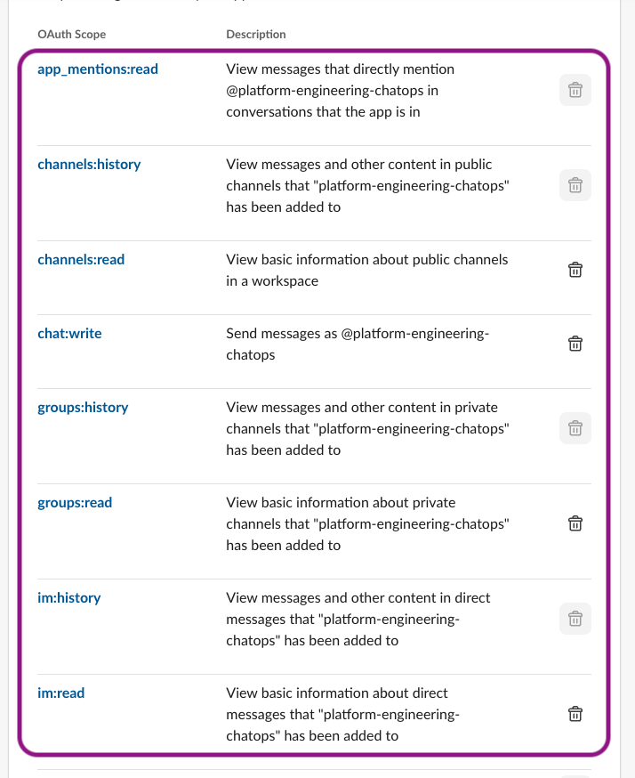
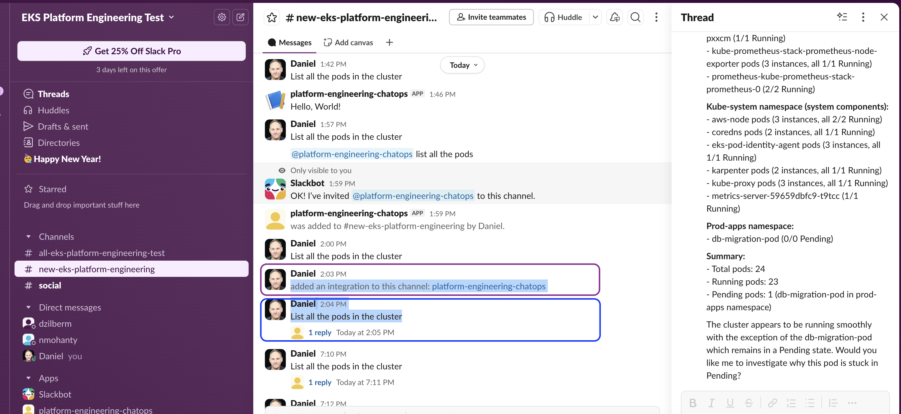

>NOTE: for sample code for this [AWS Blog](https://aws.amazon.com/blogs/architecture/architecting-conversational-observability-for-cloud-applications/) please use the [code branch](https://github.com/aws-samples/sample-eks-troubleshooting-rag-chatbot/tree/blog) from this repository.
This code branch is updated and is related to the AWS guidance below.

# Guidance for Troubleshooting of Amazon EKS using Agentic AI workflow on AWS

This guidance provides an example of Platform Engineering approach to troubleshooting Amazon EKS (Elastic Kubernetes Service) issues using Agentic AI workflow integrated with ChatOps via Slack

 **Strands-based AI Agentic workflow Troubleshooting**: An intelligent agent using AWS [Strands Agent framework](http://strandsagents.com/latest/) with [EKS MCP server](https://awslabs.github.io/mcp/servers/eks-mcp-server) integration for real-time troubleshooting

It can be deployed using [Terraform](https://developer.hashicorp.com/terraform), which provisions all necessary AWS resources including EKS cluster with compute plane, required add-ons, monitoring tools, and application-specific infrastructure.

## Architecture

### Reference Architecture - EKS Cluster


_Figure 1: Guidance for Troubleshooting of Amazon EKS using Agentic AI workflow on AWS - Reference Architecture_

### Reference Architecture Steps

1. **Log Collection and Streaming**: Amazon EKS cluster generates logs from various components (pods, services, nodes etc.) which are collected by Fluent Bit and streamed to Amazon Kinesis Data Streams for real-time processing.

2. **Log Processing and Indexing**: Amazon Kinesis Data Streams processes the incoming log data and forwards it to Amazon OpenSearch for indexing and "knowldge base" data storage, enabling fast search and retrieval capabilities.

3. **Vector Storage and Embeddings**: Log data is processed through AWS Bedrock to generate embeddings, which are stored in Amazon S3 for semantic search capabilities and knowledge retrieval.

4. **AI-Powered Analysis**: AWS Bedrock processes user queries and log context to generate intelligent troubleshooting recommendations using large language models.

5. **User Interaction Layer**: Users interact with the system through either a Gradio web interface or Slack integration, providing natural language queries about cluster issues.

6. **Agent Orchestration**: AWS Strands agent framework coordinates multiple AI agents to perform complex troubleshooting tasks, including kubectl command execution and cluster state analysis.

7. **Security and Access Control**: AWS IAM and EKS Pod Identity ensure secure access to cluster resources while maintaining proper permissions and audit trails.

### Agentic AI Workflow Architecture


_Figure 2: Guidance for Troubleshooting of Amazon EKS using Agentic AI workflow on AWS - Troubleshooting Workflow_

### Agentic AI Workflow Architecture Steps

1. **Setup** - Guidance workloads are deployed into an Amazon EKS cluster, configured for application readiness with compute plane managed by Karpenter auto-scaler.

2. **User Interaction** - Users (DevOps engineers, SREs, developers) who encounter Kubernetes (K8s) issues send troubleshooting requests through designated Slack channel integrated with K8s Troubleshooting AI Agent. Its components are running as containers on EKS cluster deployed from previously built images hosted in Elastic Container registry (ECR) via [Helm](https://helm.sh/) charts that reference the services-built images

3. **Message Reception & Slack Integration** - Slack receives user messages coming via AWS Elastic Load Balancer and establishes a WebSocket connection (Socket Mode) to the Orchestrator agent running in the EKS cluster.

4. **Intelligent Message Classification & Orchestration** - Orchestrator agent receives users’ message and calls [Nova Micro](https://docs.aws.amazon.com/ai/responsible-ai/nova-micro-lite-pro/overview.html) model via  Amazon Bedrock API to determine whether the message requires K8s troubleshooting. If an issue is classified as K8s-related, the Orchestrator agent initiates a workflow by delegating tasks to specialized agents while maintaining overall session context.

5. **Historical Knowledge Retrieval** - Orchestrator agent invokes the Memory agent, which connects to Amazon S3 Vectors based knowledge base to search for similar troubleshooting cases for precise issue classification

6. **Semantic Vector Matching** - The Memory agent invokes [Titan Embeddings](https://docs.aws.amazon.com/bedrock/latest/userguide/titan-embedding-models.html) model via Amazon Bedrock API to generate semantic embeddings and perform vector similarity matching against the shared S3 Vectors knowledge base

7. **Real-Time Cluster Intelligence** - Orchestrator agent invokes the K8s Specialist agent, which utilizes the hosted [AWS EKS Model Context Protocol (MCP) Server](https://docs.aws.amazon.com/eks/latest/userguide/eks-mcp-introduction.html) to execute commands against the EKS API Server. The Client of MCP Server gathers real-time cluster state, pod logs, events, and resource metrics to better “understand” the current problem context.

8. **Intelligent Issue Analysis** - K8s Specialist agent sends the collected cluster data to Anthropic Claude model via Amazon Bedrock for intelligent issue analysis and resolution generation. 

9. **Comprehensive Solution Synthesis** - Orchestrator agent synthesizes the historical context received from Memory agent and current cluster state from K8s Specialist, then uses Claude model via Amazon Bedrock to generate comprehensive troubleshooting recommendations, which are stored in S3 Vectors for future reference.

10. **ChatOps Integration** - Orchestrator agent generates troubleshooting recommendations and sends them back to the Users via integrated Slack channel. This illustrates an increasingly popular “ChatOps” Platform Engineering pattern. 

## Project Code Structure

```
├── apps/                           # Application code
│   ├── agentic-troubleshooting/   # Strands-based agentic troubleshooting agent
│   │   ├── src/agents/            # Strands agent implementations
│   │   ├── src/tools/             # EKS MCP tools integration
│   │   ├── helm/                  # Kubernetes deployment charts
│   │   └── main.py                # Strands agent entry point
├── terraform/                      # Infrastructure as Code
│   ├── main.tf                    # Main EKS cluster configuration
│   ├── agentic.tf                 # Strands agent deployment resources
│   ├── modules/                   # Terraform modules
│   ├── variables.tf               # Terraform variables
│   └── outputs.tf                 # Terraform outputs
├── static/                        # Static assets
└── demo/                          # Demo scripts and manifests
```

## Prerequisites

Before running this project, make sure you have the following tools installed:

- [Terraform CLI](https://www.terraform.io/downloads.html)
- [AWS CLI](https://aws.amazon.com/cli/)
- [Python 3.8+](https://www.python.org/downloads/)
- [Docker](https://www.docker.com/) (for agentic application deployment)
- [Helm](https://helm.sh/) (for agentic application deployment)
- [Kubectl](https://docs.aws.amazon.com/eks/latest/userguide/install-kubectl.html) (for K8s CLI commands)

### Slack Configuration (Required)

1. **Slack Webhook** (Alert Manager notifications):
   - Create incoming webhook in your Slack workspace
   - Note the webhook URL and target channel name

2. **Slack Bot Configuration**:
   - Create a Slack app with the following **Bot Token Scopes**:
     - `app_mentions:read` - View messages mentioning the bot
     - `channels:history` - View messages in public channels
     - `channels:read` - View basic channel information
     - `chat:write` - Send messages as the bot
     - `groups:history` - View messages in private channels
     - `groups:read` - View basic private channel information
     - `im:history` - View direct messages
     - `im:read` - View basic DM information
   
   - **Event Subscriptions** (enable these events):
     - `app_mention` - Bot mentions
     - `message.channels` - Channel messages
     - `message.groups` - Private channel messages
     - `message.im` - Direct messages
   
   - **Enable Socket Mode** for real-time events
   - Note the Bot Token (`xoxb-...`), App Token (`xapp-...`), and Signing Secret

 Please see sample settings for Slack aplication OAuth and Scope permissions below:
 
 
 
 _Figure 3: Guidance for Troubleshooting of Amazon EKS using Agentic AI workflow on AWS - Sample app OAuth permissons_
 
 
 
 _Figure 4: Guidance for Troubleshooting of Amazon EKS using Agentic AI workflow on AWS - Sample app OAuth Scopes_
 
 
 
 _Figure 5: Guidance for Troubleshooting of Amazon EKS using Agentic AI workflow on AWS - Adding Sample app to Slack Channel_

## Plan your Deployment

### AWS services in this Guidance

| **AWS Service**                                                              | **Role**           | **Description**                                                                                             |
|------------------------------------------------------------------------------|--------------------|-------------------------------------------------------------------------------------------------------------|
| [Amazon Elastic Kubernetes Service](https://aws.amazon.com/eks/) ( EKS)      | Core service       | Manages the Kubernetes control plane and compute nodes for container orchestration.                          |
| [Amazon Elastic Compute Cloud](https://aws.amazon.com/ec2/) (EC2)            | Core service       | Provides the compute instances for EKS compute nodes and runs containerized applications.                    |
| [Amazon Virtual Private Cloud](https://aws.amazon.com/vpc/) (VPC)            | Core Service       | Creates an isolated network environment with public and private subnets across multiple Availability Zones. |
| [Amazon Simple Storage Service](https://aws.amazon.com/s3/) (S3)           | Core Service         | Stores vector embeddings generated from log data and serves as the knowledge base repository for the system's semantic search capabilities.                             |
| [AWS Bedrock](https://aws.amazon.com/bedrock/)                              | Core Service       |Provides the foundational AI models for natural language processing, query understanding, and generating intelligent troubleshooting recommendations based on cluster data. |
| [Amazon OpenSearch Service](https://aws.amazon.com/opensearch-service/)| Core Service       | Stores and indexes EKS cluster logs, enabling fast search and retrieval capabilities for the system to find relevant troubleshooting information.                       |
| [Amazon Kinesis Data Streams](https://aws.amazon.com/kinesis/data-streams/) | Core Service      |Processes real-time log streams from EKS clusters, ensuring continuous data flow for immediate troubleshooting analysis and alerting.                                       |
| [Amazon Elastic Container Registry](http://aws.amazon.com/ecr/) (ECR)        | Supporting service | Stores and manages Docker container images for EKS deployments.                                             |
| [Elastic Load Balancing](https://aws.amazon.com/elasticloadbalancing/) (NLB) | Supporting service | Distributes incoming traffic across multiple targets in the EKS cluster.                                    |
| [Amazon Elastic Block Store](https://aws.amazon.com/ebs) (EBS)               | Supporting service | Provides persistent block storage volumes for EC2 instances in the EKS cluster.                             |
| [AWS Identity and Access Management](https://aws.amazon.com/iam/) (IAM)    | Supporting service   | Manages security permissions and access controls for the chatbot system, ensuring secure interaction with EKS clusters and AWS services.                              |
| [AWS Key Management Service](https://aws.amazon.com/kms/) (KMS)              | Security service   | Manages encryption keys for securing data in EKS and other AWS services.                                    |
| [AWS Lambda](https://aws.amazon.com/lambda/)                               | Optional Service     | Provides serverless compute for processing Slack webhooks and handling event-driven troubleshooting workflows when Slack integration is enabled.                        |


### Cost

You are responsible for the cost of the AWS services used while running this guidance.
As of February 2026, the cost for running this guidance with the default settings in the US West (Oregon) Region is
approximately **$457.72/month**.

We recommend creating a [budget](https://alpha-docs-aws.amazon.com/awsaccountbilling/latest/aboutv2/budgets-create.html) through [AWS Cost Explorer](http://aws.amazon.com/aws-cost-management/aws-cost-explorer/) to help manage costs. Prices are subject to change. For full details, refer to the pricing webpage for each AWS service used in this guidance.

### Sample cost table

The following table provides a sample cost breakdown for deploying this guidance with the default parameters in the
`us-west-2` (Oregon) Region for one month. This estimate is based on the AWS Pricing Calculator output for the full
deployment as per the guidance. This **does not** factor any model deployments on top of the running environment.

| **AWS service**                  | Dimensions                        | Cost, month [USD] |
|----------------------------------|-----------------------------------|-------------------|
| Amazon EKS                       | 1 cluster                         | $73.00            |
| Amazon VPC                       | 1 NAT Gateways                    | $33.75            |
| Amazon EC2                       | 2 m5.large instances              | $156.16           |
| Amazon EBS                       | gp3 storage volumes and snapshots | $7.20             |
| Elastic Load Balancer            | 1 NLB for workloads               | $16.46            |
| Amazon VPC                       | Public IP addresses               | $3.65             |
| AWS Key Management Service (KMS) | Keys and requests                 | $6.00             |
| AWS Bedrock (Titan)             | 1M input tokens, 100K output tokens | $25.00         |
| Amazon OpenSearch Service        | 3 m5.large.search instances         | $95.00         |
| Amazon Kinesis Data Streams      | 2 shards, 10GB data ingestion       | $30.00         |
| Amazon S3                        | 500GB storage, 10K requests         | $11.50         |
| AWS Lambda                       | 1M invocations, 512MB memory        | $0.00          |
| **TOTAL**                        |                                   | **$457.72/month** |

For a more accurate estimate based on your specific configuration and usage patterns, we recommend using
the [AWS Pricing Calculator](https://calculator.aws).

## Security

When you build systems on AWS infrastructure, security responsibilities are shared between you and AWS.
This [shared responsibility model](https://aws.amazon.com/compliance/shared-responsibility-model/) reduces your
operational burden because AWS operates, manages, and controls the components including the host operating system, the
virtualization layer, and the physical security of the facilities in which the services operate. For more information
about AWS security, visit [AWS Cloud Security](http://aws.amazon.com/security/).

This guidance implements several security best practices and AWS services to enhance the security posture of your EKS
Workload Ready Cluster. Here are the key security components and considerations:

### Identity and Access Management (IAM)

- **EKS Managed Node Groups**: These use IAM roles with specific permissions required for nodes to join the cluster and for pods to access AWS services.

### Network Security

- **Amazon VPC**: The EKS cluster is deployed within a custom VPC with public and private subnets across multiple
  Availability Zones, providing network isolation.
- **Security Groups**: Although not explicitly shown in the diagram, security groups are typically used to control
  inbound and outbound traffic to EC2 instances and other resources within the VPC.
- **NAT Gateways**: Deployed in public subnets to allow outbound internet access for resources in private subnets while
  preventing inbound access from the internet.

### Data Protection

- **Amazon EBS Encryption**: EBS volumes used by EC2 instances are typically encrypted to protect data at rest.
- **AWS Key Management Service (KMS)**: Used for managing encryption keys for various services, including EBS volume
  encryption.

### Kubernetes-specific Security

- **Kubernetes RBAC**: Role-Based Access Control is implemented within the EKS cluster to manage fine-grained access to Kubernetes resources.

### Secrets Management

- **AWS Secrets Manager**: While not explicitly shown in the diagram, it's commonly used to securely store and manage
  sensitive information such as database credentials, API keys, and other secrets used by applications running on EKS.

### Additional Security Considerations

- Regularly update and patch EKS clusters, compute nodes, and container images.
- Implement network policies to control pod-to-pod communication within the cluster.
- Use Pod Security Policies or Pod Security Standards to enforce security best practices for pods.
- Implement proper logging and auditing mechanisms for both AWS and Kubernetes resources.
- Regularly review and rotate IAM and Kubernetes RBAC permissions.

## Deployment Options
{TODO} update tio live IG link when publishing

Please see detailed [Implementation Guide](https://implementationguides.kits.eventoutfitters.aws.dev/tbst-eks-rag-1017/compute/troubleshooting-amazon-eks-using-rag-based-chatbot.html) for instruction for solution deployment, validation, basic troubleshooting and uninstallation options. 

## References

This project uses:

- [Terraform AWS EKS Blueprints](https://github.com/aws-ia/terraform-aws-eks-blueprints) for infrastructure
- [AWS Strands Agent Framework](https://github.com/aws/strands) for multi-agent orchestration (Agentic deployment)
- [EKS MCP Server](https://github.com/aws/eks-mcp-server) for Kubernetes integration via Model Context Protocol (Agentic deployment)
- [Amazon Bedrock](https://docs.aws.amazon.com/bedrock/latest/userguide/getting-started.html) model hosting for semantic vector matching and solution content validation
- [Slack](https://slack.com/) communications platform

## Security

See [CONTRIBUTING](CONTRIBUTING.md#security-issue-notifications) for more information.

## License

This library is licensed under the MIT-0 License. See the LICENSE file.
